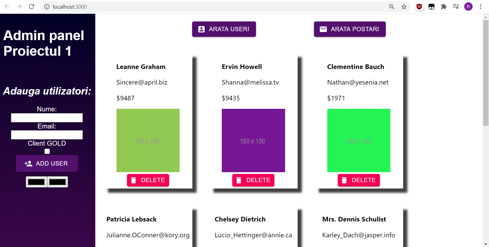

# React - Simple Admin panel

Simple admin panel using data from https://jsonplaceholder.typicode.com/. The app makes a series of requests:
1. information about users
1. lsit of pictures
1. list of posts

## Demo

## Functionalitati

* Click on 'Arata useri' - Shows the list of users
* Click on 'Arata postari' - Shows the list of posts
* Click on 'Delete' for each user - It will delete the user altogether
* Cilck on 'Add user' after typing the name and email - it will add the new user to the state and it will be displayed on page. Data from input is validated using regular expressions
* Click on the black colored boxes - the first one will change the color of the page while the other will change the color of the text